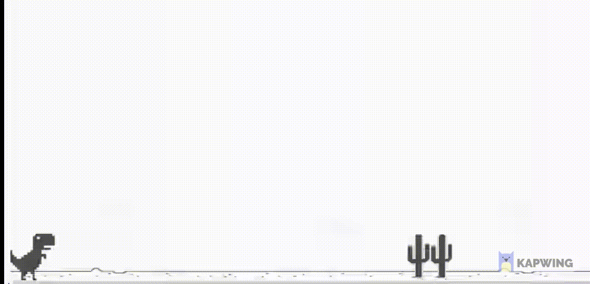

## 🚀 JS-GAMES
* This repository has a collection of games made just for the purpose of studying Javascript.

* Each folder within this repository is a game.

* Each folder contains a README.md file explaining how the game works

---

## 🖥️ How to play the games

```bash

# Clone the repository
git clone https://github.com/r-moreira/js-games.git

# Enter the folder of the game you want to play and read README.md
cd xxxx.game
```
---
## 🖥 Previews
<p align="center">
  
</p>

---

<p align="center">
  
</p>

---

<p align="center">
  
</p>

---
<p align="center">
  
</p>

---
<p align="center">
  
</p>

---

<p align="center">
  
</p>

---