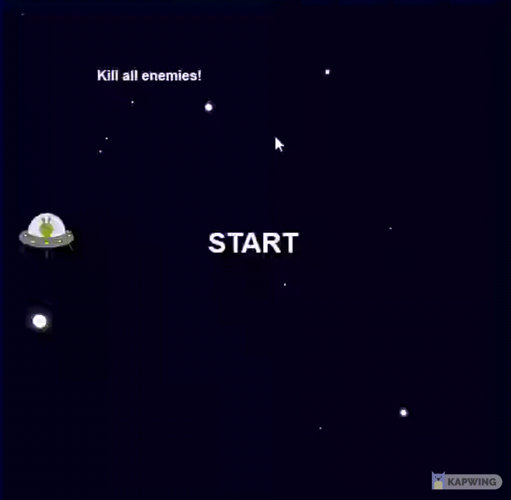

## 🚀 Space shooter
A simple space shooter game done only for the purpose of studying JS.

---

## 🖥️ How to play the game

```bash
# Clone the repository
git clone https://github.com/r-moreira/js-games.git

# Enter the game folder
cd snake-shooter-game/

# Start the game
open the index.html file using a browser
```

---
## ✅ Controls

* Use the 'arrow keys' to move the spaceship up and down
* Press 'space' to shoot the aliens

---

## 🖥 Preview
<p align="center">
  
</p>
